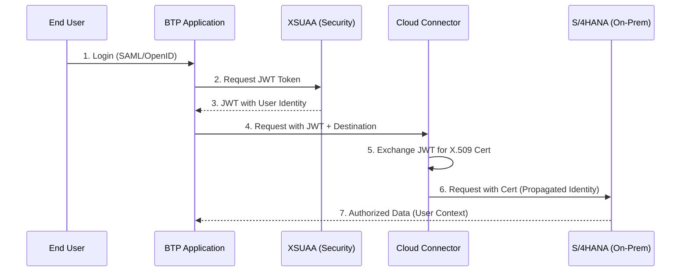
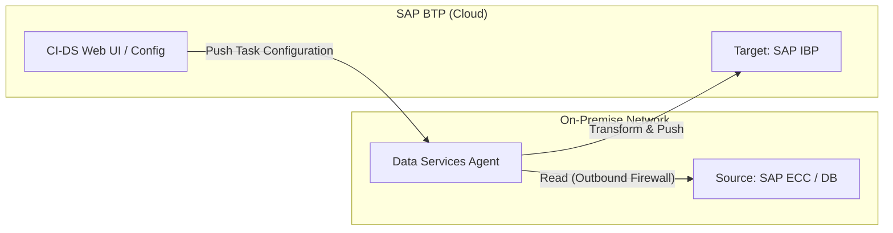

# SAP BTP Engineer: Master Interview Preparation Guide

This guide is designed for candidates interviewing for senior SAP BTP Engineer positions, specifically within global manufacturing contexts.

---

## 1. ADVANCED TECHNICAL DEEP-DIVE

### Security & Principal Propagation
**Q: Explain how Principal Propagation is achieved between SAP BTP and an on-premise SAP S/4HANA system.**
- **Difficulty:** Expert
- **Why:** Security and auditing are critical in manufacturing.
- **Key Points:** JWT, XSUAA, Cloud Connector, Short-lived certificates.
- **Diagram:**

- **Sample Answer:** We use a trust relationship between BTP and the Cloud Connector. The user authenticates via XSUAA, receiving a JWT. When the app calls a destination, it passes the JWT. The Cloud Connector maps this identity to a short-lived X.509 certificate trusted by the backend S/4HANA system, ensuring the user's actual ID is used for transaction logs and authorizations.

---

### Data Integration (CI-DS & BODS)
**Q: Describe the architecture of SAP CI-DS for a high-volume data migration scenario.**
- **Difficulty:** Advanced
- **Diagram:**

- **Sample Answer:** CI-DS uses a light-weight "Data Services Agent" installed on-prem. It initiates all communication outbound, meaning no ports need opening on the company firewall. It's optimized for feeding SAP IBP and S/4HANA Cloud. For high volume, we use partitioning in CI-DS tasks to process data in parallel across multiple agent threads.

---

### DevOps & CI/CD in BTP
**Q: How do you implement a CI/CD pipeline for a CAP-based application?**
- **Difficulty:** Advanced
- **Diagram:**

- **Sample Answer:** We treat BTP apps like modern software projects. We use GitHub Actions to trigger on code push. The pipeline runs 'mbt build' to create an MTA (Multi-Target Application) archive. We deploy this to a Dev subaccount. For Production, we use SAP Cloud Transport Management (TMS) to ensure a controlled audit trail of deployments, separating build-time automation from production-release governance.

---

## 2. SCENARIO-BASED QUESTIONS (STAR METHOD)

### Scenario: High Latency in Manufacturing Integration
- **Question:** An interface between S/4HANA and a 3rd party Warehouse Management System (WMS) is causing production delays due to latency. How do you resolve it?
- **Answer (STAR):**
    - **S:** Peak shipping hours caused the CI interface to spike to 30-second response times.
    - **T:** Reduce latency to under 2 seconds to prevent warehouse line stoppages.
    - **A:** I analyzed the iFlow and found it was making synchronous "N+1" calls to S/4HANA for every item. I redesigned it to use a single OData $batch request and implemented Redis-based caching for static master data.
    - **R:** Latency dropped to 1.5s, increasing throughput by 400% and clearing the backlog.

---

## 3. ADDITIONAL EXPERT QUESTIONS

1. **Q: How do you handle "Message Sequencing" in SAP Integration Suite when order of processing is critical?**
   - **A:** Use JMS Queues with "Exclusive Consumers" or the "Aggregator Pattern" to ensure sequential processing of messages belonging to the same business object (e.g., Sales Order).
2. **Q: Explain the role of Kyma/Kubernetes in extending SAP S/4HANA compared to Cloud Foundry.**
   - **A:** Kyma is better for containerized microservices and event-driven architectures (Serverless), while Cloud Foundry is optimized for standard polyglot business apps.
3. **Q: How do you manage "Side-by-Side" data consistency when the ERP and the BTP app share data?**
   - **A:** Use Event-Driven Architecture (Event Mesh) to keep BTP in sync with S/4HANA changes in near real-time, avoiding heavy polling.

---

## 4. PRE-INTERVIEW CHECKLIST
- [ ] Review Mermaid syntax for drawing architectures on whiteboards.
- [ ] Verify Cloud Connector mapping types (Resource vs Sub-path).
- [ ] Practice explaining 'Clean Core' to a non-technical stakeholder.
- [ ] Ensure knowledge of BODS vs CI-DS performance tuning.