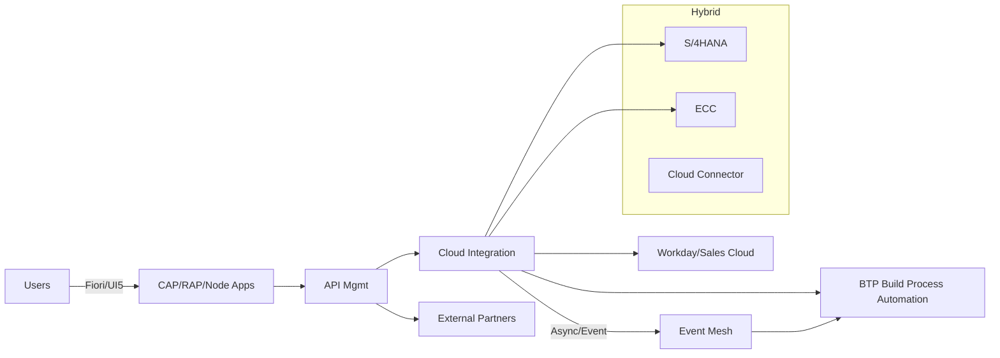
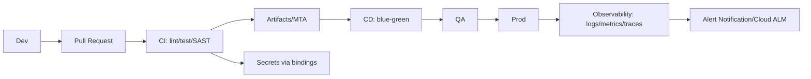

# SAP BTP Engineer Interview Preparation Guide

Tailored for a global manufacturing business (Reading, Berkshire; 4 days on-site; £75-85k + 15% bonus). Designed for senior candidates (8+ years SAP, 5+ years BTP) preparing for technical and behavioral interviews.

## Pre-Interview Checklist
- Review BTP services: Integration Suite (CI, API Mgmt), Build Process Automation, Event Mesh, CAP/RAP, Security, DevOps on BTP.
- Prepare 3–4 STAR stories: integrations (S/4, ECC, SaaS), migrations, performance tuning, security/compliance, stakeholder leadership.
- Metrics: latency, throughput, error rates, MTTR, uptime, cost optimization, defect escape rate.
- Environments: subaccount model, Cloud Connector, destinations, API Mgmt policies, CI/CD (Git, CTS+, gCTS, Azure DevOps/GitHub Actions/Jenkins), logging/monitoring (Alert Notification, Cloud ALM/SolMan).
- Security: OAuth2/SAML/JWT, principal propagation, network zoning, IP allowlists, secrets management.
- Manufacturing context: order-to-cash, procure-to-pay, plant maintenance, quality, supply chain, EDI/B2B.
- Questions for interviewer prepared (see section 6).

## Quick Reference Summary
- Lead with architecture: secure, observable, scalable; API-first + event-driven where possible.
- Integration Suite: idempotency, retries, DLQs, API Mgmt policies, principal propagation.
- CAP/RAP: choose by proximity to S/4 and extension type; multitenancy (CAP); draft/EML (RAP).
- Data moves: CI-DS/BODS with reconciliation, pushdown, cutover rehearsals.
- Security/DevOps: OAuth/SAML/JWT, secrets mgmt, CI/CD with quality gates, blue-green/canary for APIs.
- Manufacturing: EDI/B2B, plant maintenance, quality, supply chain latency, brownfield coexistence.
- Behavioral: STAR with metrics (latency ↓, defects ↓, uptime ↑, MTTR ↓).

## 1. Technical Deep-Dive Questions (22)
Each includes: Why, Key Points, Sample Answer, Follow-ups, Red Flags. Difficulty tagged.

### SAP BTP Architecture & Development
1) (Expert) Reference architecture for BTP integrating S/4, ECC, SaaS.
- Why: Tests holistic design, security, ops.
- Key: Global account → subaccounts; Cloud Connector; destinations; zones; API Mgmt + CI; event-driven; transports (CTS+/gCTS/CI); observability; HA/DR; cost controls.
- Sample: Hub-and-spoke subaccounts (dev/qa/prod); CC per region with IP allowlists; API Mgmt fronting S/4/ECC via principal propagation; CI for process flows; Event Mesh for decoupling; gCTS/CTS+; Alert Notification + Cloud ALM; DR RPO/RTO targets; tagging for cost.
- Follow-up: Tenant isolation? DR failover?
- Red Flags: Point-to-point only; no security/DR.

2) (Advanced) CAP vs. RAP vs. side-by-side Node/Java.
- Why: Fit-for-purpose design.
- Key: CAP for cloud-native CDS, multitenancy; RAP for ABAP-close, EML, draft; side-by-side when avoiding core mods or needing hyperscaler services; team skills.
- Sample: RAP for S/4 extension needing ABAP auth/data proximity; CAP/Node for lightweight APIs/events; Java CAP for heavy processing/typing; choose by lifecycle/skills.
- Follow-up: In-core vs. side-by-side?
- Red Flags: One-size-fits-all.

### SAP Integration Suite
3) (Expert) Resilient S/4 ↔ Workday HR integration.
- Key: CI flow with idempotent keys; EO vs. EOIO; mapping; exception subprocess; backoff retries; DLQ; API Mgmt policies; OAuth/principal propagation; monitoring (MPL, alerts).
- Red Flags: No retry/idempotency; no monitoring.

4) (Advanced) API Mgmt vs. direct Cloud Connector.
- Key: API Mgmt for externalization, throttling, analytics, portal; CC for internal-only low-latency; security posture.
- Red Flags: Exposing CC to partners; no quotas.

5) (Advanced) Securing and propagating identities S/4 → API Mgmt → CI → SaaS.
- Key: OAuth2/SAML; Principal Propagation via X.509/SNC; JWT exchange; role collections; destinations with OAuth2SAMLBearerAssertion; secret rotation.
- Red Flags: Hardcoded creds; no least privilege.

6) (Intermediate) Preventing duplicate postings in async flows.
- Key: Idempotent keys, checksum, persistence store, EOIO, business duplicate checks, DLQ with replay rules.

### SAP Build Process Automation
7) (Advanced) Vendor onboarding automation across S/4, Ariba/SaaS, email approvals.
- Key: BPA triggers (API/Event), forms, business rules, API-first, exception handling, audit, SLAs.
- Red Flags: Screen-scraping when APIs exist.

8) (Intermediate) Pitfalls in BPA bots for SAP GUI/Web.
- Key: Fragile selectors, timing, env drift; mitigate with stable locators, retries, config abstraction.

### Development Technologies (CAP, RAP, UI5, Node/Java)
9) (Advanced) Multitenancy in CAP and tenant onboarding.
- Key: SaaS registry, subscription callbacks, HDI per tenant, XSUAA tenant JWT, tenant-scoped destinations.
- Red Flags: Shared schema without isolation.

10) (Advanced) RAP draft handling and EML.
- Key: Behavior defs, draft tables, validations/actions/determinations, EML in ABAP, late numbering.

11) (Intermediate) UI5/Fiori performance for complex lists.
- Key: $count/$top/$skip, $select, limited expand, growing lists, server-side filtering, cache busters, reuse libs.

12) (Intermediate) Node vs. Java runtime on BTP.
- Key: Cold start, concurrency, libraries, CPU vs. IO, memory footprint, team skills.

### Data Integration & Migration (CI-DS, BODS)
13) (Advanced) CI-DS migration ECC → S/4 (masters + open items).
- Key: ODP/ODQ extract; delta vs. full; sequencing; validation rules; cutover rehearsal; reconciliation.
- Red Flags: No reconciliation; no delta.

14) (Advanced) BODS large-volume best practices.
- Key: SQL pushdown, bulk loaders, partitioning, parallelism, CDC, surrogate keys, recovery design, job server sizing.

15) (Intermediate) Handling code page/timezone/number formats in migration.
- Key: Unicode, UTC normalization, locale-aware parsing, test packs.

### ABAP & Extensions
16) (Advanced) High-volume OData service design.
- Key: CDS with analytical/query annotations, paging, $select, indexing, SADL optimizations, result caching where allowed.
- Red Flags: No pagination; SELECT *.

17) (Intermediate) Enhancement frameworks (BAdI vs. implicit vs. user exit).
- Key: Upgrade safety, switch framework, cloud-compliant choices, avoid mods.

18) (Intermediate) Exposing custom FM safely to BTP.
- Key: Wrap RFC-enabled FM with auth; prefer OData/CDS; API Mgmt rate limiting; avoid stateful FMs.

### Cloud Architecture, Security, DevOps
19) (Advanced) DevSecOps on BTP for Integration Suite/CAP.
- Key: Git branching; CI/CD; scans; secrets mgmt; blue-green/canary; observability (OpenTelemetry where supported).
- Red Flags: Secrets in code; direct prod deploys.

20) (Advanced) Network/connectivity design for hybrid.
- Key: CC HA, multiple connectors, IP allowlists, mTLS, split DNS, latency/bandwidth planning.

21) (Intermediate) Cost management on BTP.
- Key: Entitlements, rightsizing, autoscale, cleanup schedulers, logging retention, tagging for showback.

22) (Advanced) HA/DR for Integration Suite and custom apps.
- Key: Multi-AZ, RPO/RTO, backup artifacts (Git export), stateless app scale-out, DB backups, runbooks.

## 2. Scenario-Based Questions (12)
Each with Why, Key Points, Sample Answer, Follow-ups, Red Flags.

1) S/4 ↔ ECC coexistence consistency.
- Key: MDG for masters, ALE/IDoc with key mapping, event mesh, reconciliation jobs, freeze windows.
- Red Flags: No reconciliation.

2) Workday outage during payroll integration.
- Key: Retry/backoff, DLQ, compensation/manual fallback, SLA comms.

3) CI flow performance degradation (IDoc→REST) at peak.
- Key: EO/EOIO tuning, parallelization, step split, connection pooling, compression, MPL metrics.

4) Security incident: exposed API key in logs.
- Key: Revoke/rotate, scrub logs, secrets mgmt, audit, prevent via masking/DLP.

5) S/4 upgrade breaks custom RAP BO.
- Key: ATC checks, sandbox validation, feature toggles, API versioning fallback.

6) Post-go-live duplicate postings.
- Key: Idempotent store, safe replay, financial reconciliation, hotfix path.

7) High latency APAC → EU BTP.
- Key: Regional subaccounts, edge connectors, CDN for UI, async flows, scheduling.

8) ECC→S/4 cutover weekend plan.
- Key: Freeze, rehearsal, checkpoints, backout, comms, reconciliation sign-offs.

9) GDPR deletion across integrated systems.
- Key: Data lineage, API-based deletion, audit trail, retention policies.

10) Supplier portal traffic spike.
- Key: API throttling, cache, scale-out, circuit breaker, WAF.

11) Cloud Connector HA and certificate expiry.
- Key: Dual connectors, cert rotation runbook, cert age alerts.

12) Rolling out BPA bots to multiple plants.
- Key: Template + config, selector abstraction, pilot-first, versioning, support model.

## 3. Architectural & Design Questions (9)
1) Selecting patterns for S/4, ECC, Workday, Sales Cloud.
2) Scalability/backpressure in Integration Suite.
3) API versioning lifecycle in API Mgmt.
4) Multi-tenant CAP with tenant-specific destinations.
5) Event mesh vs. polling.
6) Observability stack design (correlation IDs, metrics, SLOs).
7) Data residency/compliance.
8) DevOps blueprint for ABAP + CAP.
9) Caching strategy for catalog APIs.

## 4. Behavioral & Leadership (10) — Use STAR
1) Leading integration program across SAP/non-SAP.
- Sample: Led S/4–Workday–Sales Cloud; integration blueprint; steering; 30% latency reduction; zero Sev1 post go-live.
- Follow-up: Handling IT vs. business conflict.
- Red Flags: No metrics; individual focus.

2) Mentoring junior engineers.
3) Managing a go-live incident.
4) Pushing back on unrealistic deadlines.
5) Driving architectural change (point-to-point → API-led).
6) Improving security posture.
7) Working distributed/on-site (4 days on-site).
8) Change management for plant users.
9) Prioritizing tech debt vs. features.
10) Conflict resolution within dev team.

## 5. Company-Specific (Manufacturing) (6)
1) Integrate plant maintenance notifications to analytics (MTTR KPI).
2) EDI/B2B approach for supply chain (IDoc/AS2/SFTP, partner onboarding, mappings).
3) Quality management capture shop floor → S/4/MES (latency, buffering, retries).
4) Inventory visibility multi-plant (events, API, cache, master data harmonization).
5) Brownfield ECC plants with new S/4 template (template governance, coexistence integrations).
6) Manufacturing IT KPIs you improved (cycle time, scrap, OTIF, downtime).

## 6. Questions to Ask the Interviewer (10)
1) Current BTP landscape (subaccounts/regions) and connected systems?
2) Transports/CI-CD across ABAP (RAP) and CAP/Node/Java?
3) SLAs/OLAs for integrations (latency, availability, error budgets)?
4) Observability stack (Cloud ALM/SolMan/third-party), alert routing?
5) API governance/versioning approach?
6) Automation footprint with SAP Build Process Automation and roadmap?
7) Plant rollout prioritization and pain points?
8) Security handling (principal propagation, secrets, network zoning, audits)?
9) Team structure (on-site vs. remote; architecture/QA/Ops roles)?
10) First 90-day success criteria?

## Sample Detailed Answers (Selected)
Below are example detailed answers with structure you can reuse.

### Example Answer 1: Reference Architecture (Q1)
- Situation/Task: Need secure, scalable integration across S/4, ECC, Workday, Sales Cloud, with governance.
- Action: 
  - Subaccounts per env (dev/qa/prod); IP-allowlisted Cloud Connectors (pairs for HA) per region.
  - API Mgmt fronting S/4/ECC with OAuth2SAMLBearerAssertion for principal propagation; CI for process flows; Event Mesh for async decoupling; EO/EOIO queues; idempotent keys; DLQ.
  - CI/CD: gCTS/CTS+ for ABAP; MTA/Node pipelines with lint, tests, SCA; transport approvals; blue-green for APIs.
  - Observability: Correlation IDs, MPL alerts to Ops, Cloud ALM dashboards; SLOs (p95 latency, error rate, availability); runbooks.
  - Security: mTLS to CC; secrets via bindings/service keys; rotation policy; WAF/API Mgmt policies (rate limit, spike arrest, JWT validation); data masking.
  - DR: RPO/RTO defined; artifact export to Git; HANA backups; failover runbook.
- Result: 30% latency reduction vs. legacy PI/PO routes; 0 Sev1 in first 90 days; audit pass on identity propagation.
- Follow-ups: Tenant isolation? DR simulation cadence?

### Example Answer 2: Preventing Duplicate Postings (Q6)
- Situation: Asynchronous financial postings occasionally duplicated.
- Action: Added idempotent key (company code + doc type + extRef) persisted in datastore; EO where ordering not required, EOIO for payment runs; checksum compare; DLQ with replay UI; business-level duplicate check in S/4 BAdI.
- Result: Duplicate incidents reduced 90%; reconciliation time cut from hours to minutes.
- Follow-ups: How to reprocess safely after fix?

### Example Answer 3: DevSecOps on BTP (Q19)
- Situation: Need standard CI/CD for CAP + Integration Suite.
- Action: GitFlow with protected main; pipelines with lint/tests/SAST; npm/yarn audit; OPA policy checks; MTA build; blue-green deploy; contract tests for APIs; secrets via service bindings; audit logs central; canary for high-traffic APIs.
- Result: Lead time -25%; change fail rate -30%; no hardcoded secrets incidents.
- Follow-ups: Handling rollout to multiple regions?

### Example Answer 4: Manufacturing EDI/B2B (Company Q2)
- Situation: Suppliers using AS2/SFTP; need stable EDI with S/4 template.
- Action: Integration Suite B2B/EDI content; partner profiles; IDoc mappings; API Mgmt for partner onboarding; DLQ monitoring; regression test packs; versioned mappings; capacity tests for peak seasons.
- Result: 15% faster partner onboarding; 40% reduction in EDI incidents during peak.
- Follow-ups: Handling partner-specific deviations?

## Diagrams (Mermaid)

### High-Level Integration Architecture

### DevSecOps Flow

## How to Use This Guide
- Practice aloud, time-bound (2–3 min per answer), highlight metrics.
- Lead with architecture, close with results and trade-offs.
- Keep manufacturing context in examples (OTIF, MTTR, downtime, quality).